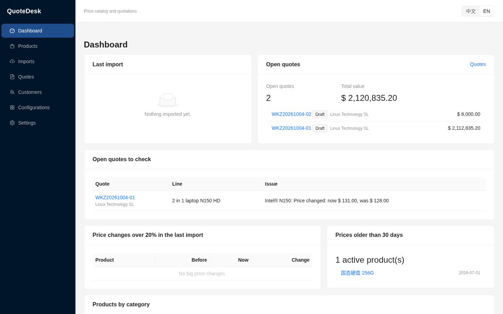
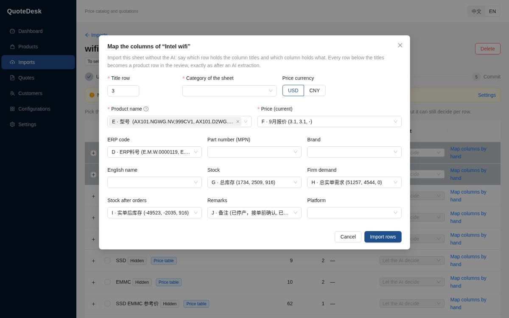
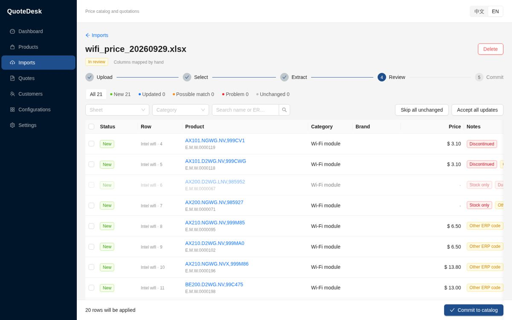
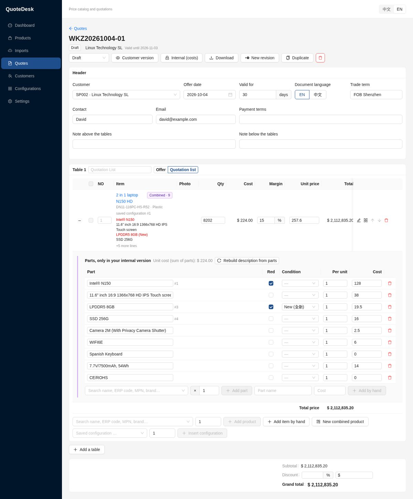
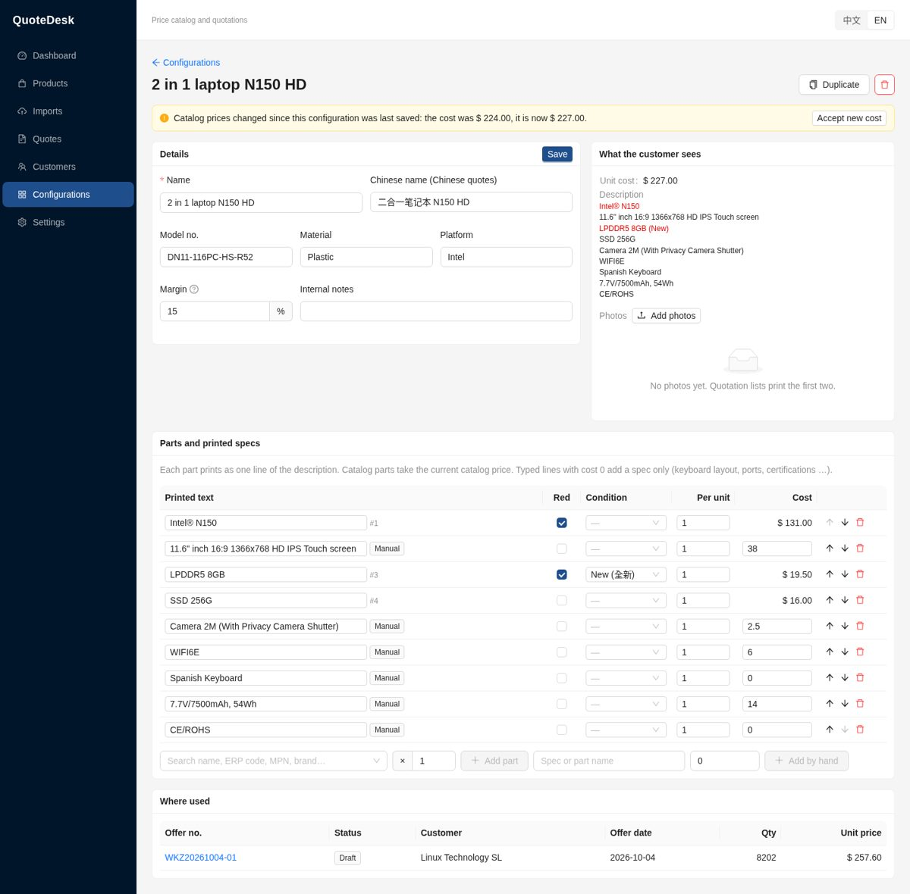
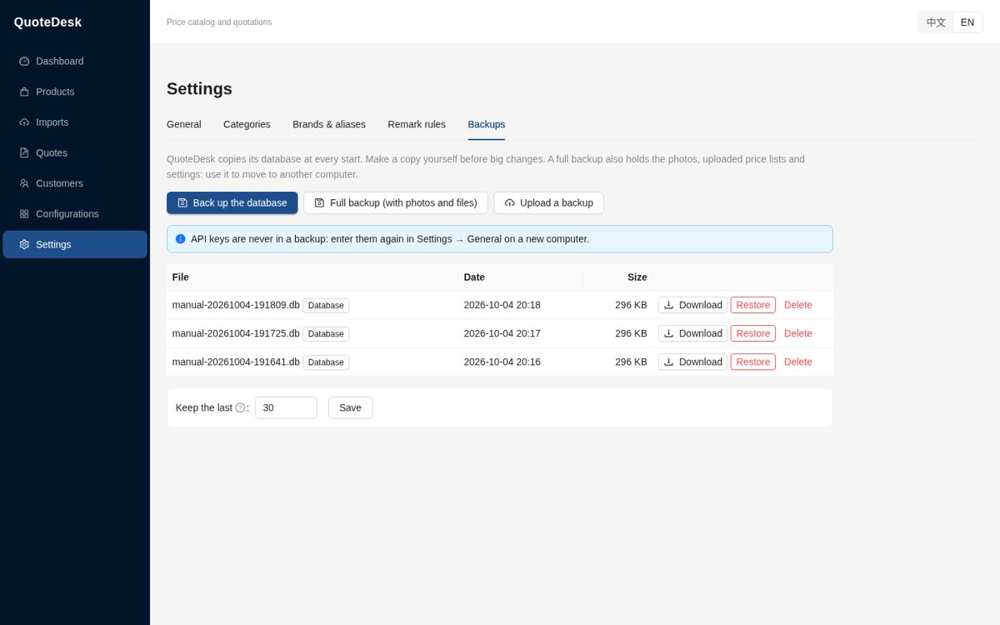

# Installing and using QuoteDesk

[中文说明](INSTALL.zh-CN.md)

QuoteDesk runs on your own computer. It keeps your products, prices, customers and quotes in one
folder, and you use it in your web browser. Nothing goes on the internet except the price lists you
choose to read with AI.

## 1. Install

### Windows (recommended): the QuoteDesk folder

1. Get the file `QuoteDesk-windows.zip`. It is built on GitHub: **Actions → Desktop build →** the
   latest run **→ Artifacts**.
2. Unzip it to a folder you keep, for example `D:\QuoteDesk`. Don't run it from inside the zip.
3. Double-click **`QuoteDesk.exe`**. A black window opens and your browser shows QuoteDesk at
   **http://127.0.0.1:8765**.
   - The first time, Windows may say *"Windows protected your PC"*. Click **More info → Run anyway**.
     The program is not signed, which is why Windows asks.
4. Keep the black window open while you work. **Closing it stops QuoteDesk.** To use QuoteDesk
   again, double-click `QuoteDesk.exe` again.

Your data lives in the **`data`** folder next to `QuoteDesk.exe`.

**Updating:** unzip the new version to a new folder, move your `data` folder into it, then start
the new `QuoteDesk.exe`. QuoteDesk upgrades the database by itself and backs it up first.

### macOS or Linux: from the source

You need Python 3.11 or newer, and Node.js for the first start. In the QuoteDesk folder, run
`./start.sh` (on Windows, `start.bat` does the same). The first start installs everything, which
takes a few minutes. Later starts are immediate.

## 2. First steps

1. **Settings → General**:
   - Upload your company logo.
   - Check the offer number prefix (`WKZ`) and your default margin.
   - Fill in the bank details and the seller contact for proforma invoices.
2. **AI import (optional).** In Settings → General, pick a provider and paste its API key, then
   click **Test connection**. Without a key, you can still import Excel files by mapping the columns
   yourself (see below).
3. **Customers:** add your customers with their code (for example `SP002`), contact and trade term.

## 3. Import a price list

On the **Imports** page, drop an Excel/CSV file, screenshots or PDFs. Then do one of these:

- **Extract with AI.** The AI reads every row (needs an API key).
- **Map columns by hand** (spreadsheets only). Say which row holds the titles, which column is the
  name, the price, the ERP code, the stock … and the sheet's category. QuoteDesk suggests a mapping
  from the column titles.

Either way, you then **review** every row: new, updated, unchanged, possible duplicate or problem.
Nothing changes in your catalog until you click **Commit to catalog**. **Revert import** undoes
the last import.

## 4. Make a quote

**Quotes → New quote**, pick the customer, then add products from the catalog or type items by hand.

- **Combine** several lines (CPU + RAM + SSD …) into one product. The customer sees one row, with
  the parts as its description and one price.
- Save builds you sell often under **Configurations**, then **Insert configuration** in any quote.
  Their parts always use today's catalog prices.
- **Customer version** is the PDF or Excel file to send. **Internal (costs)** is your own copy, with
  the cost, margin and profit of every line.
- When the customer accepts, mark the quote **Accepted** and create the **proforma invoice**.

## 5. Backups

QuoteDesk copies its database every time it starts and keeps the last 30 copies. In
**Settings → Backups** you can:

- **Back up the database** now, before a big import, for example.
- Make a **Full backup**: the database plus photos, uploaded price lists and settings.
- **Restore** any copy. Your current data is saved first, so a restore can be undone.
- **Upload a backup**, to move to another computer.

**Moving to a new computer:** make a full backup and download it, install QuoteDesk on the new
computer, upload the backup there and restore it. API keys are never in a backup, so enter them
again in Settings.

## 6. If something goes wrong

- **The browser says it can't connect.** Check that the black QuoteDesk window is open. If it closed
  at once, look at `data/logs/app.log`.
- **"Address already in use".** QuoteDesk is already running: open http://127.0.0.1:8765.
- **An import fails with an AI error.** Check the key with **Test connection** in Settings, or map
  the columns by hand.
- Your work is never lost when QuoteDesk stops. Everything is saved as you type.
