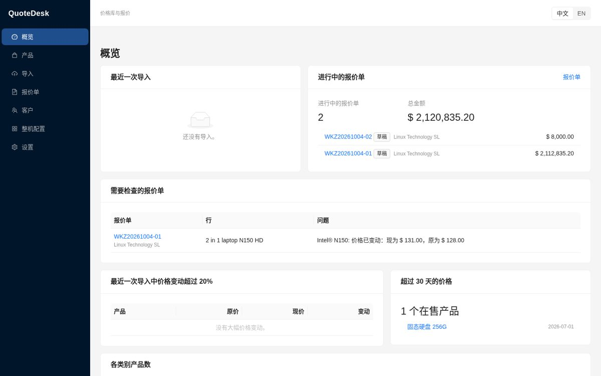
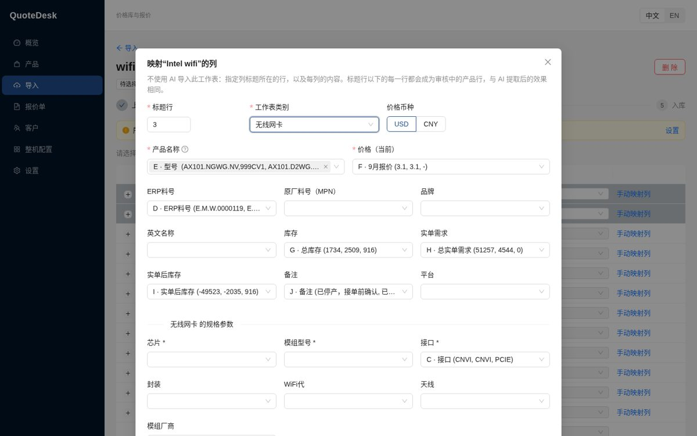
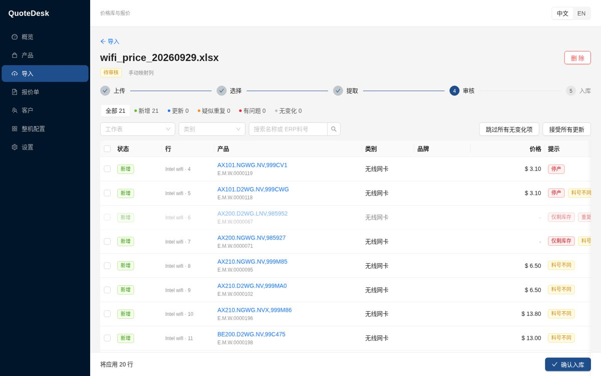
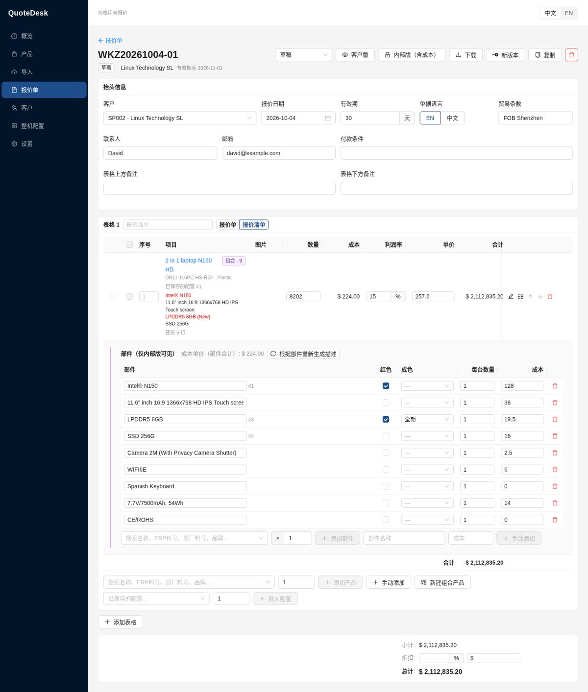
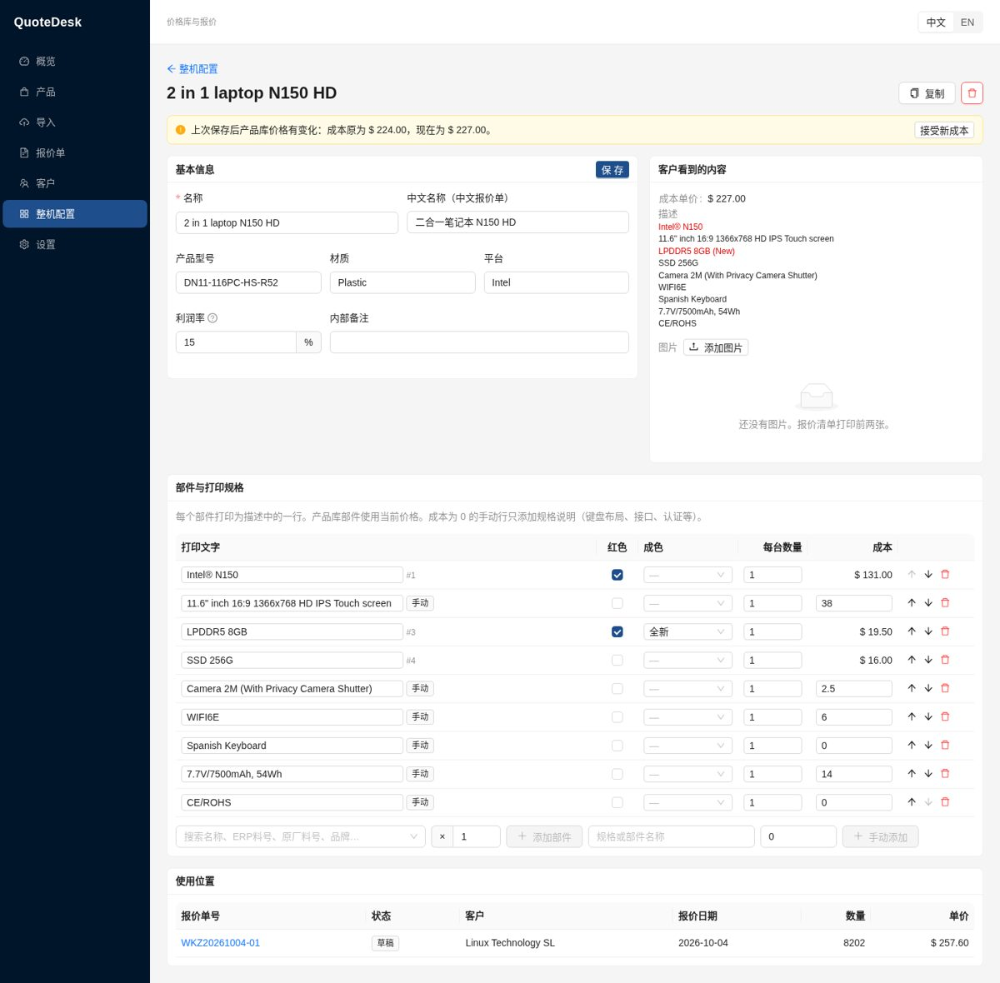
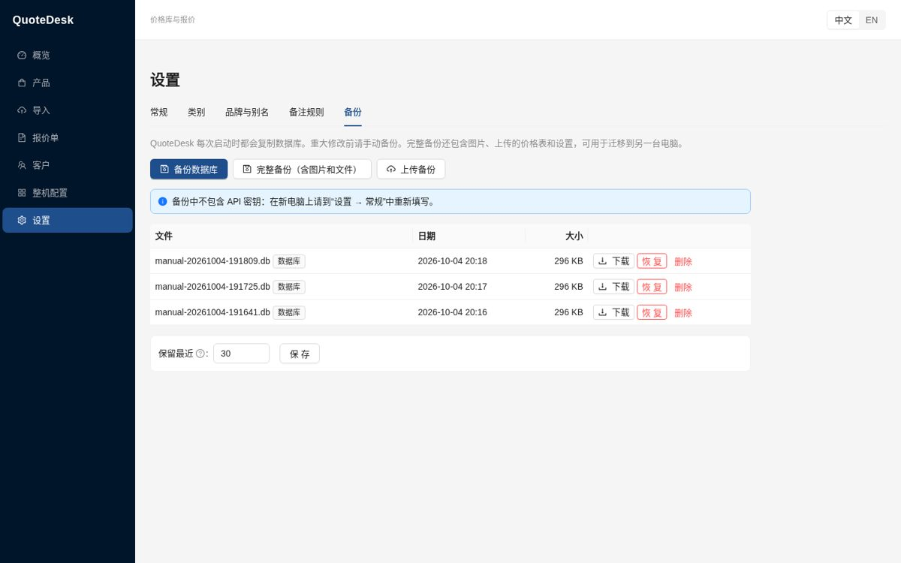

# QuoteDesk 安装与使用说明

[English](INSTALL.md)

QuoteDesk 运行在您自己的电脑上：产品、价格、客户和报价单都保存在一个文件夹里，在浏览器中使用。
除了您选择用 AI 读取的价格表之外，不会有任何数据上传到网上。

## 1. 安装

### Windows（推荐）：QuoteDesk 文件夹

1. 获取 `QuoteDesk-windows.zip` 文件。它在 GitHub 上生成：**Actions → Desktop build →** 最新一次运行
   **→ Artifacts**。
2. 解压到一个固定的文件夹，例如 `D:\QuoteDesk`。不要直接在压缩包里运行。
3. 双击 **`QuoteDesk.exe`**。会打开一个黑色窗口，浏览器随后显示 QuoteDesk，地址为
   **http://127.0.0.1:8765**。
   - 第一次运行时，Windows 可能提示“Windows 已保护你的电脑”。请点击 **更多信息 → 仍要运行**。
     出现提示是因为程序没有数字签名。
4. 使用期间请保持黑色窗口打开。**关闭该窗口即停止 QuoteDesk。** 下次使用时再双击 `QuoteDesk.exe`。

您的数据保存在 `QuoteDesk.exe` 旁边的 **`data`** 文件夹中。

**升级：** 把新版本解压到一个新文件夹，再把原来的 `data` 文件夹移进去，然后运行新的
`QuoteDesk.exe`。QuoteDesk 会先自动备份数据库，再自动升级。

### macOS 或 Linux：从源代码运行

需要 Python 3.11 或更高版本，首次启动还需要 Node.js。在 QuoteDesk 文件夹中运行 `./start.sh`
（Windows 上用 `start.bat`，作用相同）。首次启动会自动安装所需组件，需要几分钟，之后再启动会很快。

## 2. 开始使用

1. **设置 → 常规**：
   - 上传公司 Logo。
   - 检查报价单号前缀（`WKZ`）和默认利润率。
   - 填写形式发票上的银行信息和销售联系人。
2. **AI 导入（可选）：** 在“设置 → 常规”中选择 AI 服务并粘贴 API 密钥，然后点击 **测试连接**。
   没有密钥时，也可以通过手动映射列来导入 Excel（见下文）。
3. **客户：** 添加客户，包括客户代码（例如 `SP002`）、联系人和贸易条款。

## 3. 导入价格表

在 **导入** 页面拖入 Excel/CSV 文件、截图或 PDF，然后选择以下一种方式：

- **用 AI 提取**：AI 逐行读取（需要 API 密钥）。
- **手动映射列**（仅限表格文件）：指定标题所在的行，以及名称、价格、ERP料号、库存等分别在哪一列，
  再选择工作表的类别。QuoteDesk 会根据列标题自动给出建议。

无论哪种方式，接下来都要 **审核** 每一行：新增、更新、无变化、疑似重复或有问题。点击 **确认入库**
之前，产品库不会有任何改动。**撤销导入** 可以还原最近一次导入。

## 4. 制作报价单

**报价单 → 新建报价单**，选择客户，然后从产品库添加产品，或手动输入条目。

- 可以把多行（CPU + 内存 + SSD……）**合并** 为一个产品：客户只看到一行，部件列在描述中，只显示一个价格。
- 经常销售的整机可以保存到 **整机配置**，之后在任何报价单中 **插入配置**。部件始终使用产品库的当前价格。
- **客户版** 是发给客户的 PDF 或 Excel；**内部版（含成本）** 是您自己的副本，包含每一行的成本、利润率和利润。
- 客户确认后，把报价单状态改为 **已接受**，然后创建 **形式发票**。

## 5. 备份

QuoteDesk 每次启动时都会自动复制数据库，并保留最近 30 份。在 **设置 → 备份** 中可以：

- 立即 **备份数据库**，例如在大批量导入之前。
- 做一次 **完整备份**：数据库，加上图片、上传的价格表和设置。
- **恢复** 任意一份备份。恢复前会先保存当前数据，因此恢复也可以撤销。
- **上传备份**，用于迁移到另一台电脑。

**更换电脑：** 先做完整备份并下载，在新电脑上安装 QuoteDesk，然后上传该备份并恢复。备份中不包含
API 密钥，请在设置中重新填写。

## 6. 常见问题

- **浏览器提示无法连接：** 请确认 QuoteDesk 的黑色窗口是打开的。如果窗口一打开就关闭，请查看
  `data/logs/app.log`。
- **提示“Address already in use”（地址已被占用）：** QuoteDesk 已经在运行，直接打开
  http://127.0.0.1:8765 即可。
- **导入时出现 AI 错误：** 在设置中用 **测试连接** 检查密钥，或改用手动映射列。
- QuoteDesk 关闭时不会丢失任何内容：所有修改在输入时就已保存。
